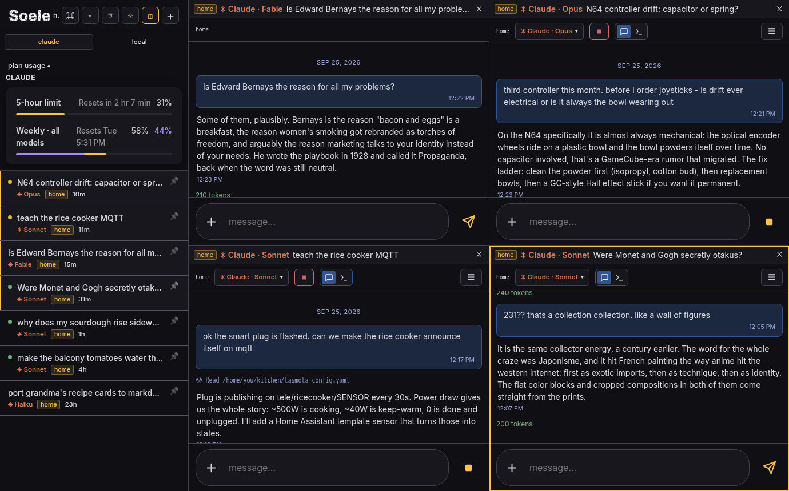
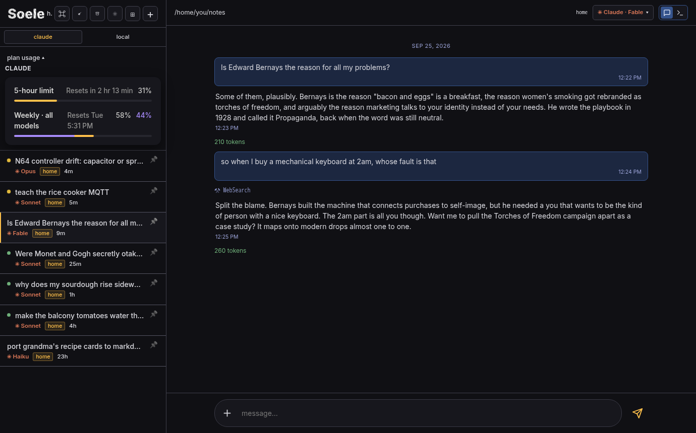
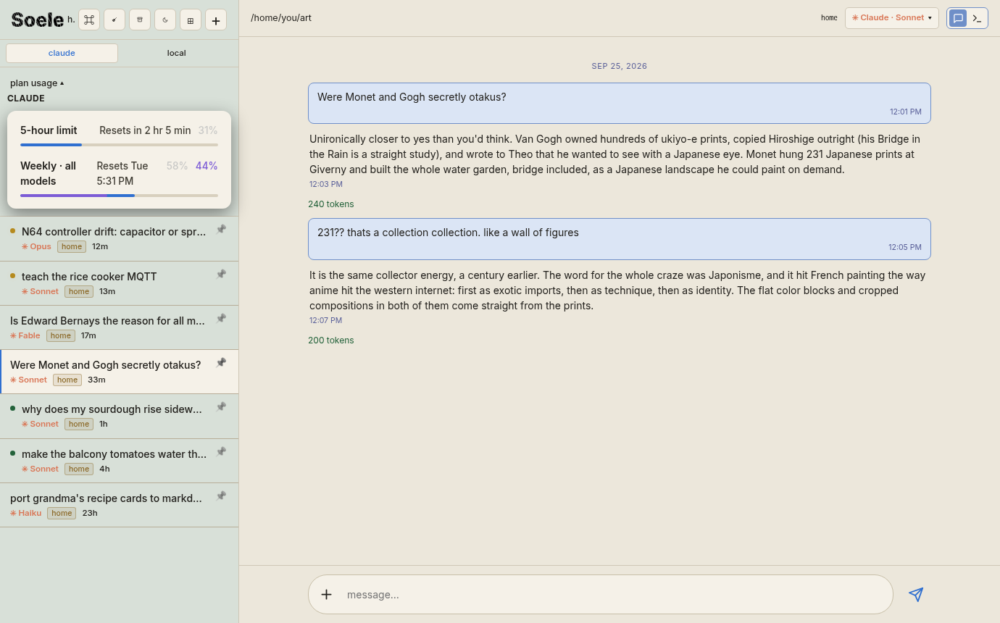
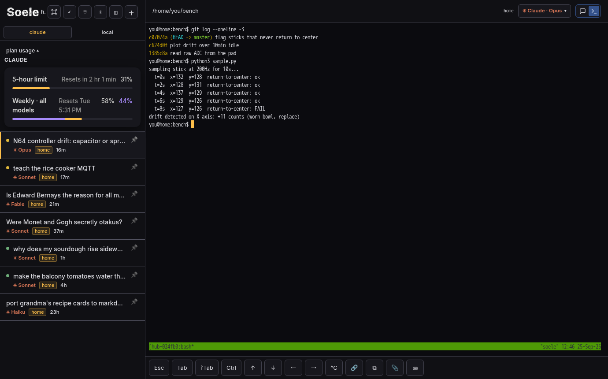
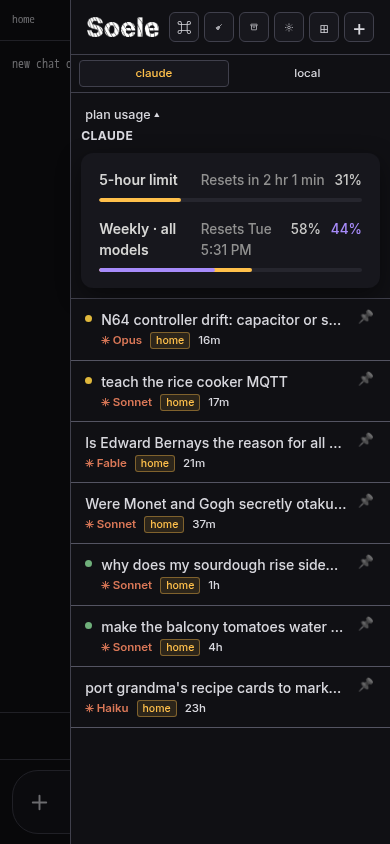

# Soele

A self-hosted switchboard for coding agents. One web UI, served from your own
box, where your Claude Code sessions (and other engines) are lines you operate:
open several at once, watch which ones are thinking right now, walk away and
come back to the finished turn.

It is a single FastAPI daemon and a single HTML file. No build step, no
database, no accounts. Sessions are real `claude` processes on your machine;
the UI streams their transcripts from disk, so a dead browser tab never kills
a turn and a reconnect replays what you missed.

## Current Features

* **Chat and terminal modes.** Chat is a clean transcript view over `claude -p`.
Terminal is the real TUI over tmux (xterm.js), not an imitation of one.
* **Grid view.** Open all your sessions at once, tiled, instead of alt-tabbing
a list. Close them all with one gesture too.
* **Live dots.** The sidebar shows which sessions are mid-turn right now.
* **Multi-node.** Run the same daemon on several machines; one of them becomes
the gateway and merges the rest. Each session stays on its node.
* **Worker containers.** On a Proxmox host, sessions can run inside cloned LXC
containers stamped from a golden template, so each project gets a disposable
box. See the companion [golden-container](https://github.com/Floral-Overcast/golden-container) project for the template side.
* **More engines.** Any OpenAI-compatible local server (LM Studio, llama.cpp,
vLLM) gets its own row. Gemini and Codex CLIs are supported where installed.
* **Usage meter.** A bundled header-tap proxy reads your real rate-limit
numbers from API responses. No estimates; the meter shows what Anthropic says.
* **Session sweep.** A configured LLM reads each chat and suggests what to
archive or delete. Suggestions only; nothing happens without your click.
* **Phone-friendly.** It is a PWA; add it to your home screen, or build the
Android TWA against your own origin for a real launcher app
([docs/ANDROID.md](docs/ANDROID.md)). The layout is yours to reshape,
including shifting the whole thing for your hand.

## Screenshots

| | |
|---|---|
|  |  |
|  |  |

## Install

See [docs/INSTALL.md](docs/INSTALL.md). Short version: Python 3.11+, a
`claude` login on the box, `pip install fastapi uvicorn httpx`, copy
`hub.env.example` to `/etc/hub.env`, install `hub.service`, open `:8800` on
your LAN. TLS and phone access are covered in the install doc.

## Security posture

Read [docs/SECURITY.md](docs/SECURITY.md) before exposing anything. The short
version: Soele is LAN software; put real TLS and auth in front of it before it
touches the internet, and give sessions a scoped folder or a worker container
rather than your home directory.

## License and support

AGPL-3.0. Run it, fork it, reshape it; if you host a modified version for
others, share your changes. If it earns a place in your week, there's a
[Patreon](https://www.patreon.com/FloralOvercast).

## Status

Extracted from a switchboard that has run a multi-machine homelab daily since
mid-2026. The extraction is fresh; expect rough edges where your setup differs
from the one it grew up in. Issues welcome.

